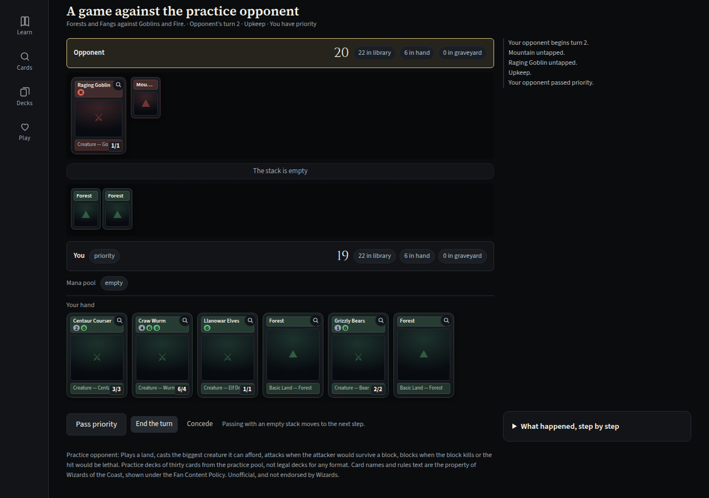

# Robert Porter — Selected Work

[LinkedIn](https://www.linkedin.com/in/robert-j-porter/) · [robertporter343@gmail.com](mailto:robertporter343@gmail.com) · Denver, Colorado

I run a solo recruiting practice in Denver, and I build software: the tools my recruiting work
runs on, an estimating system for a roofing company I worked for, and apps for problems I ran
into outside of work.

Every project here started the same way — with a real problem and nothing that quite fit. A
pricing workbook that couldn't leave the office. A candidate pool nobody was systematically
working, and a screening process that ate a day a week. A card game with no on-ramp for someone
who has never played, a game beta with no way to take a note, and an ancient language with no
bridge from vocabulary drills to reading real texts. Each time, I engineered my way out rather
than buy a tool that almost fit.

This repository is a **showcase**, not a code dump. Each project below has a write-up
covering what it does, how it's built, and the decisions I'd defend in a review. Most of
the source is private, because it touches client and candidate data — happy to walk through
any of it directly. MTG Companion and Hearthkeeper have nothing confidential in them, so both
are public, with live apps you can open.

Every write-up opens with a short *At a glance* summary — problem, what I built, result — so
you can get the gist of each in under a minute and read further only where it's useful.

## At a glance

| Project | What it is | Headline result | Source |
|---|---|---|---|
| [Excel CES](projects/excel-ces.md) | Phone-first estimating app that replaced a roofing contractor's ~700-formula workbook | Matched five real completed workbooks at **0.00 error** | Private |
| [Sourcing Engines](projects/sourcing-engines.md) | Trade-license candidate discovery and an LLM role-fit scorer for my recruiting practice | Calibration on **104 real interviews** overturned the rubric's central assumption | Private |
| [MTG Companion](projects/mtg-companion.md) | Offline Magic: The Gathering app that teaches new players by playing | **1,600+ unit tests** and 33 browser specs gating every deploy | [Public](https://github.com/rporter33/mtg-companion) · [live](https://rporter33.github.io/mtg-companion/) |
| [Hearthkeeper](projects/hearthkeeper.md) | Offline field journal for testers in the *World of Warcraft: Forever* beta | Coverage scored against what the level cap can reach, not the whole patch | [Public](https://github.com/rporter33/hearthkeeper) · [live](https://rporter33.github.io/hearthkeeper/) |
| [Anagnosis](projects/anagnosis.md) | Offline Ancient Greek reader, from the alphabet to Homer | No accounts or server; learners own their progress as a file | Private |

---

## Projects

### [Excel CES — Cost Estimating System](projects/excel-ces.md)
A mobile-first PWA that replaced a roofing contractor's estimating workbook.

Around 700 spreadsheet formulas reimplemented as a tested pricing engine, validated
against five real workbooks at **0.00 error**. Full role-based access model, price-history
auditing, and estimate snapshotting so catalog changes never rewrite historical bids.

`Next.js 15 (App Router)` · `Prisma 6` · `PostgreSQL/Supabase` · `Clerk v7` · `Tailwind` · `Vitest` · `Vercel`

---

### [Sourcing Engines](projects/sourcing-engines.md)
Two Python pipelines that find candidates who aren't on LinkedIn, and score them
against a role using only job-relevant criteria.

The first pulls ~27,000 active Colorado trade licenses from the state's public open-data
API and detects newly licensed individuals on each run. The second is an LLM scoring
engine whose rubric was calibrated against **104 real interviews**, then re-checked blind
on the same corpus: it correctly gated **20/20** commission-averse candidates and rated
**18/19** actual hires viable, with a 36-point score separation between the two groups.

`Python` · `Claude API (Haiku)` · `Socrata open data` · `structured LLM output` · `corpus calibration`

---

### [MTG Companion](projects/mtg-companion.md) · [live app](https://rporter33.github.io/mtg-companion/) · [source](https://github.com/rporter33/mtg-companion)
A local-first Magic: The Gathering companion, built around the thing no existing tool does:
getting a brand-new player to their first game.

A 27-beat guided game teaches by playing — the user makes every decision while a coach
explains it. Around it sit a card reference, an offline life counter, and a deck builder
that validates against ten formats' real construction rules, prices a list in three
markets, deals sample hands, tracks what you own and diffs saved versions. Ban lists are read
from Scryfall at validation time rather than copied into the repo, because a stale copy fails
**silently**. The land recommender was calibrated against decks that demonstrably work after
the intuitive objective turned out to be measurably wrong — it recommended 27 lands in a
60-card deck. The newest work is a table for real games that two devices can share. More than
1,600 unit tests and 33 browser specs back it, and the browser suite gates every deploy.

`React` · `Vite` · `PWA` · `IndexedDB` · `Scryfall API` · `WebRTC` · `Vitest` · `GitHub Pages`

---

### [Hearthkeeper](projects/hearthkeeper.md) · [live app](https://rporter33.github.io/hearthkeeper/) · [source](https://github.com/rporter33/hearthkeeper)
A local-first field journal for testers in the *World of Warcraft: Forever* beta.

It logs a finding from a title alone, scores test coverage against what the beta's current
level cap can actually reach rather than the whole patch, and exports a forum-ready report
stamped with the game build. Every game fact carries a flag saying where it came from —
announced, reported, carried over or unconfirmed — because during a beta most "facts" are
somebody's paraphrase. 84 unit tests cover a logic core with no React in it, and a browser
smoke test cuts the network mid-run to prove the app and its data survive.

`React` · `Vite` · `PWA` · `localStorage` · `Vitest` · `GitHub Pages`

---

### [Anagnosis · ἀνάγνωσις](projects/anagnosis.md)
A local-first Ancient Greek reader that takes you from the alphabet to Homer.

Handwriting recognition, a 19-passage graded reader, a core frequency deck, and
pattern-adaptive spaced repetition — all running offline with no accounts, no server,
and no user data to lose. Learners own their progress as a JSON file.

`React` · `Vite` · `PWA / service worker` · `localStorage` · `spaced repetition`

---

## What these have in common

**I write the reasoning down.** Most of these projects have an `ARCHITECTURE.md` or a
blueprint document explaining not just what was built but which trade-offs were accepted and
when to revisit them. Excel CES, MTG Companion and Hearthkeeper each keep a standing "Known
trade-offs" table with a *When to revisit* column.

**I validate against reality, not vibes.** The pricing engine was checked against real
completed workbooks. The candidate scorer was re-run blind against the interview corpus it
was calibrated on, with the outcomes stripped out, specifically to see whether it would
reproduce actual hiring behavior. When it disagreed once, I went and looked at why — and the
disagreement turned out to be correct.

**I take the compliance surface seriously.** Screening people with an LLM is a genuine
legal risk if done carelessly. The scoring engine is advisory-only by construction, scores
exclusively job-relevant signals, and refuses to consider age, gender, race, national
origin, family or marital status, or financial proxies — with those constraints written into
the rubric itself rather than bolted on afterward. During corpus analysis, protected details
appearing in 41 of 104 interview records were recorded as a presence flag only and never
entered any scored field.

---

## A note on what's here

Client names and candidate data are deliberately absent. The recruiting work involves real
people's applications and a real company's internal hiring data, none of which belongs in
a public repository — so the write-ups describe the engineering and the aggregate findings,
never the underlying records.

## Contact

[LinkedIn](https://www.linkedin.com/in/robert-j-porter/) · [robertporter343@gmail.com](mailto:robertporter343@gmail.com) · 📍 Denver, Colorado
