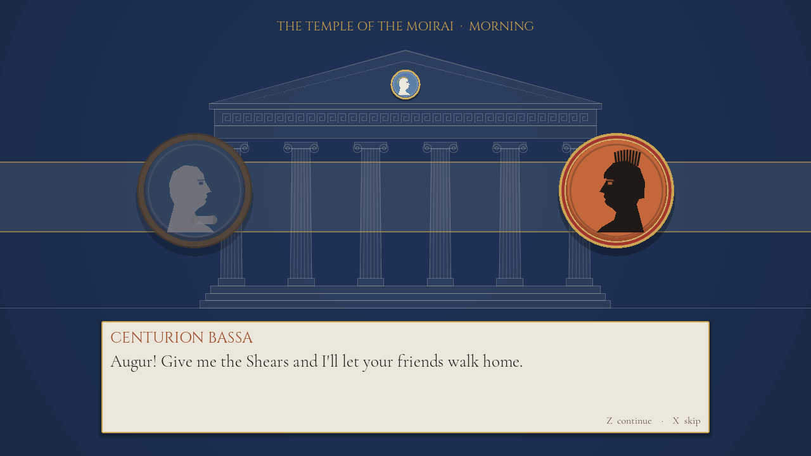
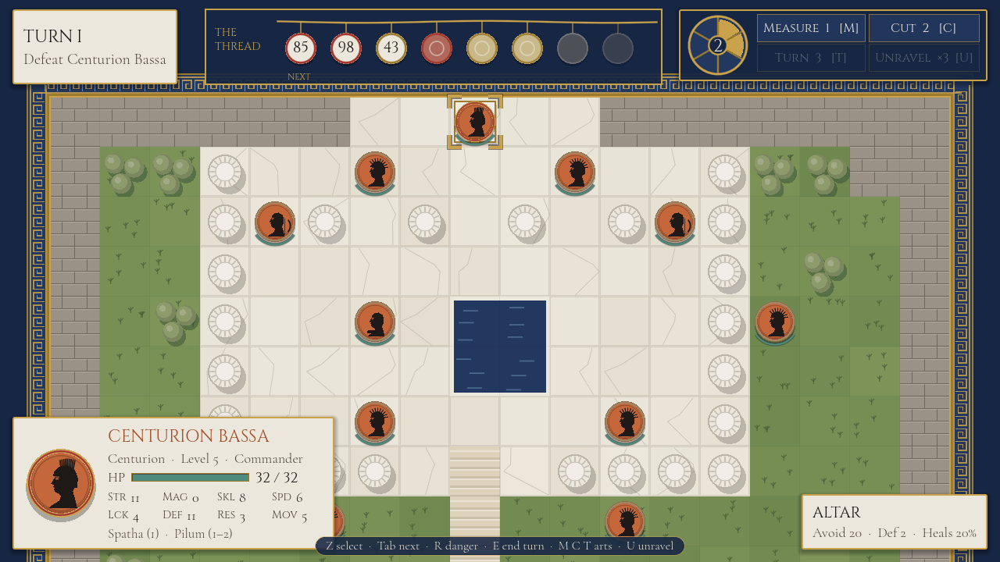
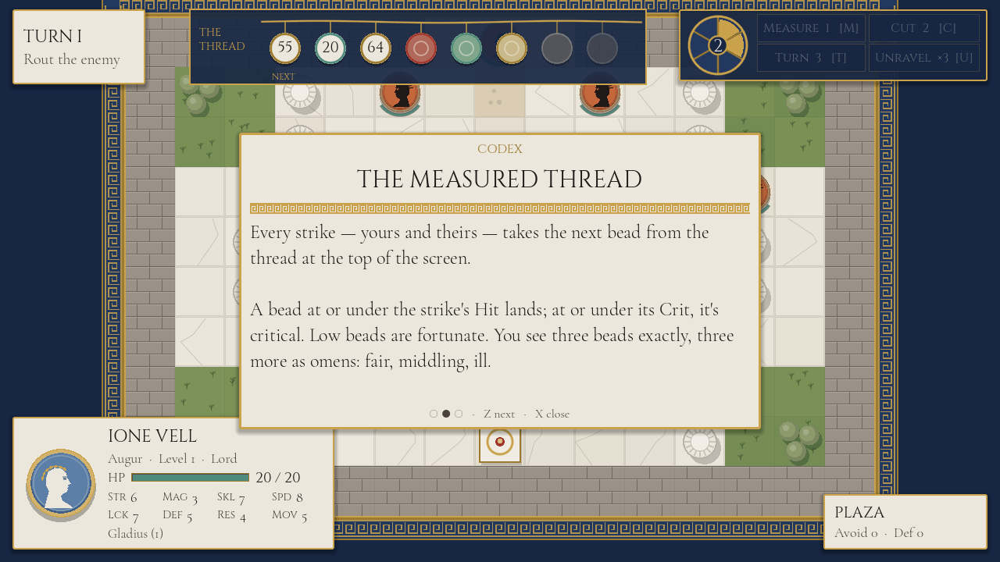

# Laurel & Loom

*Fortune is a thread. Read it, cut it, turn it.*

A neoclassical tactical RPG for PC, built in **Godot 4**, inspired by
*Fire Emblem: Fortune's Weave*. Grid battles in marble plazas and olive groves, units drawn as
Wedgwood and black-figure cameos — and one idea of its own: **the dice are visible**. Every
strike takes the next bead from the Measured Thread across the top of the screen, and the
heroine, an Augur, can cut a bead away or turn it over.


- [Design document](docs/DESIGN.md) — the mechanic, the maths, the cast
- [Art direction](docs/ART_DIRECTION.md) — palette, type, cameos, frieze UI
- [Roadmap](docs/ROADMAP.md) — the stages and what each one must prove

## Status

**The first act is playable start to finish**: a prologue and three chapters (Rout, Seize,
Survive, Defeat-the-commander), seven companions, dialogue between battles, experience and
level-ups, Classic and Casual modes, saves between chapters, settings, and Windows and Linux
builds. Stages 5–7 (enemy commanders who read the thread, a hub between battles, branching
routes) are planned in the [roadmap](docs/ROADMAP.md).

## Screenshots

| | |
|---|---|
|  |  |
| **Title** — a hexastyle temple drawn in code, the thread across its capitals | **Measure and Turn** — every visible bead exact; the front bead turned over |
|  |  |
| **Danger zone** — everything the enemy can reach next phase | **Enemy phase** — their strikes spend the same thread |
|  |  |
| **Between battles** — dialogue staged as a frieze | **Chapter III** — Bassa holds the altar |

## Running it

1. Install [Godot 4.7](https://godotengine.org/download) (standard build, not .NET).
2. Open `game/project.godot` in the editor and press **F5**, or from a terminal:
   `godot --path game`

**Building for PC.** With Godot's export templates installed (Editor → Manage Export
Templates), the presets in `game/export_presets.cfg` produce single-file builds:

```sh
godot --headless --path game --export-release "Windows Desktop" build/windows/LaurelAndLoom.exe
godot --headless --path game --export-release "Linux" build/linux/LaurelAndLoom.x86_64
```

## Playing

| | Keyboard | Mouse |
|---|---|---|
| Move the cursor | Arrows / WASD | Hover |
| Select, move, confirm | Z / Enter / Space | Left click |
| Back | X / Esc | Right click |
| Next ready companion · danger zone · end turn | Tab · R · E | |
| Measure · Cut · Turn · Unravel | M · C · T · U | Buttons, top right |
| Fullscreen | F11 | Settings |

Z on an empty tile opens the map menu (End Turn, Codex, Settings). The Codex before the
prologue explains the thread in three pages.



**How the thread plays.** Every strike takes the front bead; low is lucky. Before you attack,
the forecast shows each strike's bead and what it will do. Order your attacks so the good
beads go to your blows and the bad ones fall to the enemy's — or spend Fortune to cut or
turn a bead. Fortune only fills when luck goes against you.

## Tests

```sh
GODOT=/path/to/godot game/tools/run_tests.sh      # everything below; fails on any script error too
```

- **Rules** (`tests/unit/`, 68 tests): pathfinding, combat maths, the thread, Fate Arts,
  Unravel, objectives, the AI, experience and level-ups, reinforcements, the roster, saves.
  The central one checks, across ~700 fights, that the forecast never disagrees with the fight.
- **Chapters**: every chapter played AI-against-AI on 25 seeds must end, with invariants
  checked after every phase; the whole act is played through with a carried roster.
- **Smoke** (`tools/smoke.tscn`): plays every chapter, then a whole campaign from the title
  screen to the ending, through the real scenes and controller — the calls keyboard and mouse
  make — including Measure, Cut, Turn, Unravel, saving and Continue.

The rules live in `game/src/core/` as plain objects with no scene nodes, which is what makes
them testable headlessly and makes Unravel a state snapshot.

## Credits

Fonts: [Cinzel](https://github.com/NDISCOVER/Cinzel) and
[Cormorant Garamond](https://github.com/CatharsisFonts/Cormorant), SIL Open Font License
(licences in `game/assets/fonts/`). Everything else — art, sound, music — is generated by
code in this repository. *Fire Emblem* is a trademark of Nintendo / Intelligent Systems;
this is an independent game inspired by it, with no affiliation.
