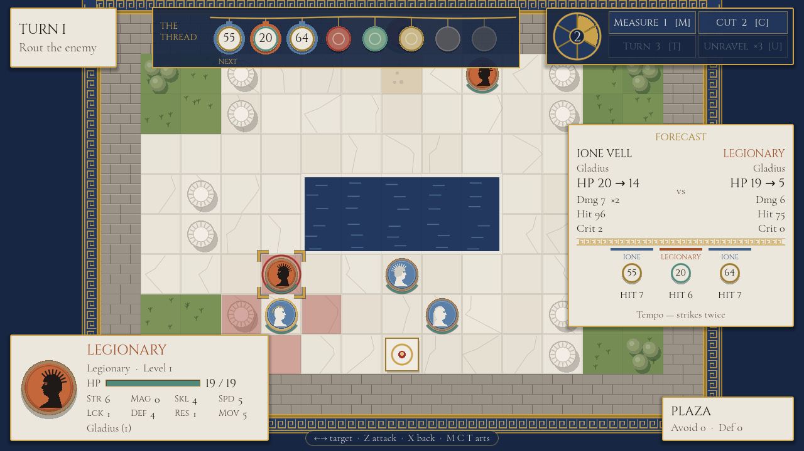
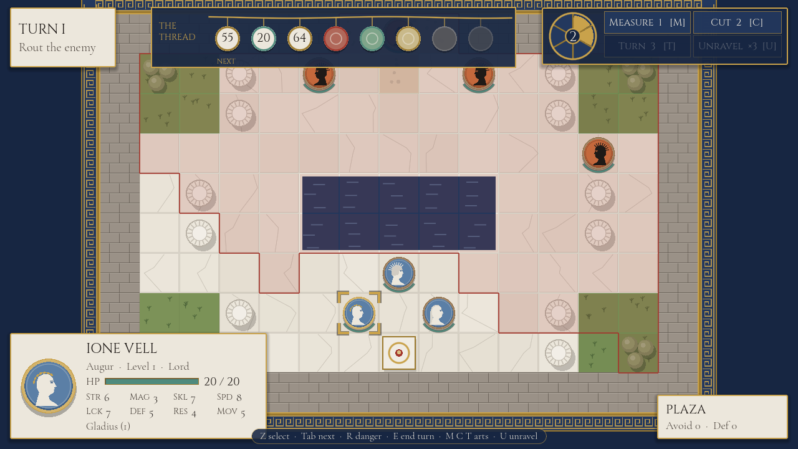
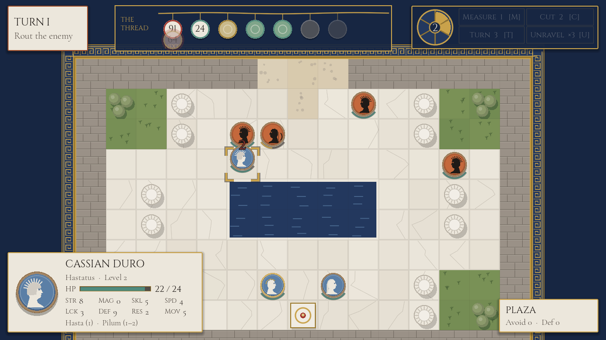

# Laurel & Loom

*Fortune is a thread. Read it, cut it, turn it.*

A neoclassical tactical RPG for PC, built in **Godot 4**, inspired by
*Fire Emblem: Fortune's Weave*. Grid battles in marble plazas and olive groves, units drawn as
Wedgwood and black-figure cameos — and one idea of its own: **the dice are visible**. Every
strike takes the next bead from the Measured Thread across the top of the screen, and the
heroine, an Augur, can cut a bead away or turn it over.



- [Design document](docs/DESIGN.md) — the mechanic, the maths, the cast
- [Art direction](docs/ART_DIRECTION.md) — palette, type, cameos, frieze UI
- [Roadmap](docs/ROADMAP.md) — the stages and what each one must prove

## Status

Built in stages; see the [roadmap](docs/ROADMAP.md) for where it stands.

## Screenshots

| | |
|---|---|
|  |  |
| **Title** — a hexastyle temple drawn in code, the thread across its capitals | **Measure and Turn** — every visible bead exact; the front bead turned over |
|  |  |
| **Danger zone** — everything the enemy can reach next phase | **Enemy phase** — their strikes spend the same thread |

## Running it

1. Install [Godot 4.7](https://godotengine.org/download) (standard build, not .NET).
2. Open `game/project.godot` in the editor and press **F5**, or from a terminal:
   `godot --path game`

Controls: arrows/WASD or the mouse to move the cursor; **Z**/Enter/left-click to confirm;
**X**/Esc/right-click to cancel; **Tab** next unit; **R** danger zone; **E** end turn.

## Tests

```sh
GODOT=/path/to/godot game/tools/run_tests.sh                   # rules: pathfinding, combat, thread, AI, chapters
godot --headless --path game res://tools/smoke.tscn          # plays every chapter through the real battle scene
```

The rules live in `game/src/core/` as plain objects with no scene nodes, so they test
headlessly; the smoke run drives the actual battle controller, AI on both sides, until
each chapter ends.
