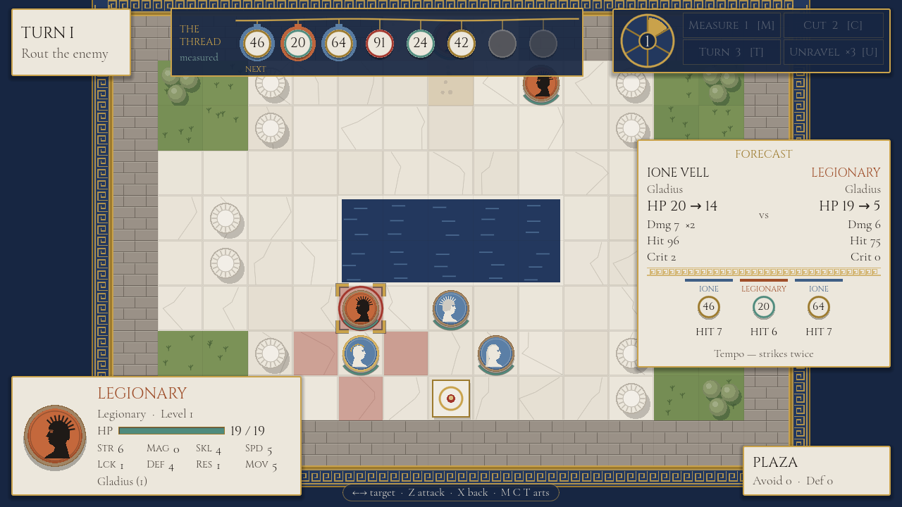
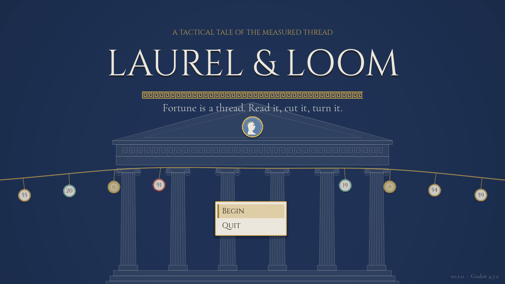

# Laurel & Loom

A neoclassical tactics game for PC, built in Godot and inspired by *Fire Emblem: Fortune's
Weave* — with one idea of its own: the dice are on the table.

## At a glance

- **Problem:** tactics games roll their dice out of sight. A 90% strike that misses feels like
  the game cheating, and the numbers leave the player nothing to plan with except hope.
- **What I built:** a grid tactics game where every roll is a numbered bead on a thread across
  the top of the screen, drawn by both sides in turn — and the first act of a campaign on top of
  it: four battles, seven companions, dialogue, level-ups, saves, and Windows and Linux builds.
- **Result:** the combat forecast never disagreed with the fight across **~700 seeded combats**;
  68 tests over a rules core with no scene nodes in it; the whole act played from the title
  screen to the ending by a scripted player on every test run.
- **Source:** private — happy to walk through it.
- **Stack:** Godot 4.7 · GDScript · headless test runner · Python (sound synthesis) · Windows and Linux exports

---

## The idea

Every tactics game rolls dice you never see. You're shown a 90% chance to hit, you miss, and
there is nothing to learn from it except that 90 is not 100.

*Laurel & Loom* puts the dice on the table. Across the top of the screen runs the Measured
Thread: the next rolls the game will make, as numbered beads. Every strike — yours or the
enemy's, attack, counter or follow-up — takes the bead at the front. Low is lucky: a bead at or
under the strike's hit chance lands, and at or under its critical chance it crits.

So the order you act in matters as much as where you stand. Spend the 7 on the killing blow;
leave the 94 at the front when you end your turn, for the enemy archer to draw. Three beads are
shown exactly and the next three only as omens — fair, middling, ill — which keeps a turn a plan
rather than a solved puzzle.

The heroine, an Augur, can reach into the thread: **Measure** shows every visible bead exactly,
**Cut** discards the front bead, **Turn** flips it, so a 94 becomes a 7. They're paid for with
Fortune, a gauge that fills only when luck goes against you — a miss, a critical taken, a new
turn. Three times a battle, **Unravel** takes back the last action.

## Borrowed, and changed

From *Fortune's Weave* I took the grid, the rewind, and its best idea: no weapon triangle, so
each weapon type is a way of playing rather than a rock-paper-scissors slot. The verbs are my
own. Swords follow up more easily. Spears are effective against cavalry. An axe that lands a
hit shoves its target back a tile. A bow is steadier when the archer hasn't moved. Hymns ignore
cover. Its signature arts, paid for in HP, became Fate Arts paid for in misfortune.

## The decision I'd most want to defend

The whole design rests on one promise: **what the forecast says is what happens.** A forecast
that's right 99% of the time is worse than none, because the time it's wrong is the time the
player trusted it.

So combat is three functions over one source of truth. `plan()` works out who strikes, in what
order and with what numbers, and touches no randomness. `forecast()` reads the thread without
drawing from it. `resolve()` draws the beads and applies the damage. The last two walk the same
plan, so there's no second copy of the rules to drift.

It's pinned by a test: six weapon match-ups across 119 seeds each, the thread advanced by a
varying amount before each fight, the forecast compared with the resolved fight strike by
strike — about 700 combats, no disagreements. The same test checks that whatever the forecast
calls *possible* always includes what actually happened, and that's what lets it say more than
the exact beads alone.

**An omen can still be certain.** A "fair" bead is somewhere from 1 to 33. Against a 90% strike,
every one of those hits, so the forecast says HIT rather than "?". The same interval check
settles an unseen bead against a 0% strike, or a 100% strike that can't crit. The forecast commits to an outcome whenever the range
decides it, not only when the number is showing.

## Decisions I'd defend

**The rules have no nodes in them.** The grid, pathfinding, combat, the thread, battle state and
the AI are plain objects in one folder; the battle scene asks what happens, then animates it.
That's what makes the rules testable headlessly, and it's why Unravel is a state snapshot rather
than an undo system.

**Growth is fated too.** A level-up rolls each stat against its growth, but the roll is seeded by
the companion and the level being reached, not drawn from the thread. Ione's level 5 is the same
level 5 however many times you retry or unravel, so no one can farm a better one.

**A retried battle is the same battle.** Each campaign has its own seed mixed into every
chapter's thread, so two playthroughs see different beads; within one, a lost battle comes back
with the same thread. It becomes something you learn, which suits a game about reading it.

**Art and sound are code.** No sprite sheets and no samples. Units are cameos — white relief on
Wedgwood blue for your side, black figure on terracotta for the enemy — tiles are marble slabs,
olive groves and ashlar, and the title is an Ionic temple front drawn line by line. Every sound
effect and both music loops come from a short Python synthesizer: a plucked-string model for the
lyre, a pitch-swept sine for the frame drum. Apart from two open-licence typefaces, the
repository holds nothing it didn't generate.

  
  

## What running it found that the tests didn't

**The title screen passed everything and rendered as a heap in the top-left corner.** Setting a
full-screen layout from inside the screen's setup code keeps its current size — zero — by moving
its edges instead. Screenshots taken under a virtual display caught it, and from then on every
screen was reviewed as an image, not just exercised.

**A Survive map could be won on turn two.** The scripted player cleared Chapter II's first wave
before any reinforcements had arrived, which counted as a rout. Clearing the field no longer
wins while more enemies are still due.

**The scripted campaign got stuck losing Chapter I forever.** Same seed, same choices, same
defeat — determinism doing exactly what it was designed to do. The driver now varies its choices
on a retry, and the episode is what led to per-campaign seeds.

**The lyre was measured rather than trusted.** Measuring each note's pitch found the low notes
within a cent and A5 ten cents sharp, because the textbook fractional-delay filter is only exact
near zero frequency. Solving its coefficient at each note's own frequency brought every note
measured, D3 to E6, within one cent.

## Testing

Everything runs headlessly from one script, which fails on any script error as well as on a
failed check — a GDScript runtime error aborts the function it's in without failing anything.

- **68 unit tests, 40,647 checks:** pathfinding, combat maths, the thread and the Fate Arts,
  Unravel, objectives, the AI, experience and level-ups, reinforcements, the roster, and saves
  round-tripping through JSON.
- **Every chapter AI against AI** on 25 seeds, with invariants checked after every phase — no two
  units on one tile, nobody standing in a wall, HP in range — and the whole act played through
  with the roster carried from chapter to chapter.
- **A smoke run through the real scenes:** it drives the battle controller with the same calls
  the keyboard and mouse make, through every chapter and then an entire campaign from the title
  screen to the ending, including Measure, Cut, Turn, Unravel, saving and Continue.

Windows and Linux builds export from presets in the repository as single files; the Linux build
was booted under a virtual display.

## Built in stages

The plan came first: a design document, an art direction, and a roadmap in which every stage
ends in something playable and a written list of what it must prove before the next begins.

| Stage | Delivered | Proved by |
|---|---|---|
| The Plan | Design, art direction, roadmap | — |
| The Board | Grid, movement, combat, enemy AI, turns | Pathfinding, combat and AI tests; an AI-vs-AI battle always ends |
| The Thread | Beads, forecast, Fortune, Fate Arts, weapon traits, Unravel | The forecast matches the fight across seeds; the same choices replay the same battle |
| Marble & Lyre | Type, cameos, frieze interface, title, synthesized sound | Screenshots of every screen read as one style |
| The First Act | Four chapters, dialogue, growth, roster, saves, settings, exports | The act plays from title to ending; saves round-trip |

Three more are planned: commanders who read the thread too, a hub between battles, and branching
routes.

## Known trade-offs

Carried in the repository's `ROADMAP.md`, each with a trigger for revisiting it. A sample:

| Trade-off | Why it's acceptable now | When to revisit |
|---|---|---|
| Art drawn in code, not painted | A coherent look without an artist, committed to a style that suits vector drawing | A painted-art pass once the design stops moving |
| Difficulty checked by AI-vs-AI win rates | The only signal available while building; a person with the thread, the arts and Unravel does far better than the naive player AI, which finishes the act, with retries, in 9 runs of 12 | The first outside playtest |
| A retried battle replays the same thread | It makes the thread learnable | If retries start to feel like rote |
| Enemies ignore the thread | Keeps the AI fair and legible | When enemy commanders get Fate Arts of their own, on purpose |
| Saving only between chapters | Mid-battle state is small, but a suspend save is its own interface | When chapters grow past about twenty minutes |

## Legal

An independent game inspired by *Fire Emblem: Fortune's Weave*, not affiliated with or endorsed
by Nintendo or Intelligent Systems. It contains no assets from any *Fire Emblem* game: every image
and sound is generated by code in the repository, and the two typefaces are under the SIL Open
Font License.
