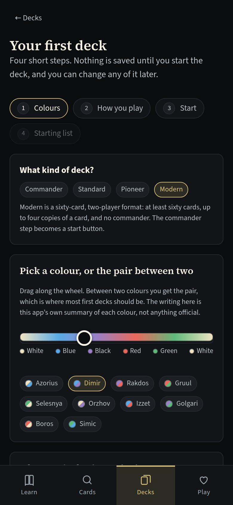
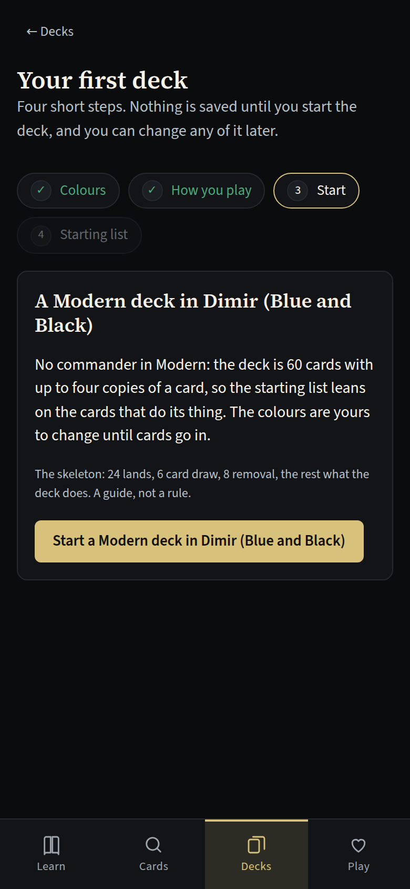

# MTG Companion

A local-first Magic: The Gathering companion — card reference, format-aware deck builder,
play companion, and an interactive guide that teaches the game by playing it.

**[Open the app →](https://rporter33.github.io/mtg-companion/)** · works offline and installs as a PWA.

## At a glance

- **Problem:** Magic has excellent tools for people who already play, and nothing that gets a
  brand-new player to their first game.
- **What I built:** a guided first game where the player makes every move while a coach
  explains it — and around it a card search, a deck builder that checks ten formats' rules,
  an offline life counter, a practice table that enforces the rules of play, and a free table
  for real games that two devices can share.
- **Result:** more than 1,600 unit tests and 33 browser specs, with the browser suite gating
  every deploy; a land-count recommender that matches the decks people actually play, after the
  intuitive formula asked for 27 lands in a 60-card deck.
- **Source:** public — [github.com/rporter33/mtg-companion](https://github.com/rporter33/mtg-companion)
- **Stack:** React · Vite · PWA (service worker + manifest) · IndexedDB · localStorage · Scryfall API · Vitest · GitHub Pages

---

## The idea

Magic has excellent tools for people who already play. Scryfall is a superb card database.
Archidekt and Moxfield are strong deck builders. There are a dozen competent life counters.

What none of them do is get a new player to their first game. The official tutorial is a
video. The rulebook is 280 pages. The usual advice is "find someone to teach you", which is
fine if you know someone and useless if you don't.

So the differentiator here isn't the card search — it's the guided first game. Everything
else is the utility layer a player needs once they're actually playing.

## Four pillars

**Learn.** A 27-beat guided game against a scripted opponent. The player makes every play —
plays the land, chooses the block, casts the combat trick — with a coach explaining each
step. Behind it sit twelve lesson modules across four tracks (never played a card game,
Arena player new to paper, coming from another TCG, returning after years away) and a
44-term glossary wired through the entire app as tappable dotted underlines.

**Cards.** Search using Scryfall's own query syntax, so anything a player already knows
works unchanged. Full oracle text, official rulings, legality across ten formats, every
printing, prices.

**Decks.** Ten formats — six constructed, four in the Commander family — validated against
each format's real construction rules as you build. Paste a list from anywhere, see it priced
in three markets, group it by your own sections or by type in a list or a card grid, draw
sample hands against it, mark what you own and what the rest would cost, and compare any two
saved versions of it. A coach reads the list and says what it is short of, and why.

**Play.** A life counter for games with physical cards. One to six players, commander damage
per source, poison and other counters, phase tracker, full undo, works entirely offline.

## The decision I'd most want to defend

The deck builder recommends a land count. The obvious way to compute one is to ask: how many
lands do I need to never miss a land drop?

I built that, then measured it against decks that demonstrably work:

| Deck | Lands | Makes the land drop |
|---|---|---|
| 60-card constructed | 17 | **49.9%** by turn 3 |
| 60-card constructed | 24 | **78.9%** by turn 3 |
| 100-card Commander | 37 | **54.5%** by turn 4 |

Nobody builds toward "never miss a land drop", because nobody can. A recommender aimed at it
asks for 27 lands in a 60-card deck, which no deck in the game plays. The intuitive objective
was simply wrong, and it was only visibly wrong because I checked it against reality instead
of shipping a principled-looking formula.

The objective that *does* describe how decks are built is narrower: have at least two mana
sources in your opening seven. Solving that hypergeometrically at an 85% threshold reproduces
the accepted ratios — **24 sources for 60 cards, 16 for 40, 40 for 100** — against the deck's
real size rather than a table lookup. Those three numbers are pinned as tests, so a future
change that looks more rigorous but stops matching real decks fails the suite.

Colour-source advice works the same way: rather than reproducing a published table, the app
solves the same question the table answers, for this deck's actual size.

## Ban lists are deliberately not in the repository

Banned and restricted status is read from Scryfall's per-card `legalities` object at
validation time, never from a copy in the codebase.

Ban lists change on a rolling announcement schedule. A hardcoded copy would be wrong within
weeks — and wrong *silently*, confidently passing a deck that a judge would disqualify. What
is encoded is only the structure that doesn't move: deck sizes, copy limits, singleton,
commander requirements, starting life. When Scryfall has no legality data for a format, the
validator reports `unknown` rather than passing.

Validation reports specific violations rather than a pass/fail:

> Commander decks must be exactly 100 cards. This deck has 99 — 1 short.
> Counterspell is outside your commander's colour identity (U).
> Vintage restricts Black Lotus to one copy, but this deck has 2.

The rules that are easy to get subtly wrong all have tests: the four-copy limit applies
across maindeck *and* sideboard combined, "a deck can have any number of cards named…" keeps
Relentless Rats legal in a singleton format, the commander counts toward the 100, and
colour identity includes mana symbols in the rules text, not just the mana cost.

## The tutorial is scripted, not simulated

Every beat declares its exact board state. The tutorial cannot desync, cannot present an
illegal board, and needs no network — its card data is bundled and its cards render in CSS.

The alternative is a rules engine. Covering even ten cards correctly is a multi-year project
— Forge and XMage are the evidence — and it would not teach any better. The trade-off is
recorded explicitly: the thing a real engine would unlock is free play, which the tutorial
deliberately does not offer. Free play came later, from separate models built for it (see
[How it grew](#how-it-grew)).

Narrative continuity is enforced by tests rather than by re-reading:

- graveyards never shrink between beats
- life totals never rise (no card in the script gains life)
- no more than one land is played per turn — the tutorial teaches that rule, so it had
  better not break it
- every beat's click target actually exists in the zone it names

The graveyard and life invariants each caught a real authoring slip where dead creatures
silently vanished from the opponent's graveyard mid-lesson.

## Offline is a case, not a fallback

Cards referenced by a saved deck are **pinned** in IndexedDB and never evicted, so a deck
built at home opens on a phone with no signal at a game store — which is exactly where a life
counter and a decklist are needed and exactly where the wifi is worst.

Every cache read is best-effort: private browsing, disabled storage or a quota error degrades
to a cache miss, never to a broken app. The service worker caches the shell and card images
but deliberately does **not** intercept the Scryfall API, because the app's own cache layer
understands pinning and staleness in a way a blind HTTP cache cannot. The guide and life
counter never touch the network at all.

Card faces render in CSS from card data as well as loading Scryfall's images. That isn't a
placeholder — it's a fully readable card, it's what the tutorial renders from, and it's more
legible to a beginner than a 200-pixel scan. Cards measure themselves with container queries
and shed detail as they narrow rather than ellipsing "Grizzly Bears" down to "Gri…".

## Treating a free API as a guest

Scryfall is volunteer-funded and asks clients to be gentle. Every request in the app goes
through a single serial queue enforcing 100ms spacing regardless of how many components fetch
at once. 429 and 5xx retry with exponential backoff; 4xx doesn't, because it's a real answer.
A search matching nothing returns 404 and is surfaced as zero results, not an error. A
rejected request can't stall the queue behind it — there's a test for that specifically.

One requirement can't be met: Scryfall asks for a descriptive `User-Agent`, and browsers
forbid scripts from setting that header. That's documented rather than quietly ignored.

## What running it found that the tests didn't

Early on, 153 tests passed and the build was clean — and the app still rendered a blank page
the first time I opened it in a browser.

`vite.config.js` set the base path only when `command === 'build'`, but `vite preview` runs
as a *serve* command. Preview hosted at `/` while the built HTML pointed at
`/mtg-companion/`, which meant the production build couldn't be verified locally at all. Two
more came out of the same session: the coach panel was sticky-positioned and covered the
hand it was telling the player to tap, and two empty battlefields consumed 190px on turn one,
pushing the hand off the bottom of a phone screen.

None of those would ever have failed a unit test. The full 27-beat tutorial is now walked end
to end in a headless browser as part of verification, asserting that each beat actually
advances and that no console errors fire. That became the rule for everything after it: more than
1,600 unit tests cover the logic, and thirty-three browser specs drive the real interface for the parts
a unit test cannot see.

## How it grew

After the tutorial, the app grew in deliberate steps, each one measured before it was called
done. The [build log](mtg-companion-build-log.md) has the full account; the short version:

**Into a real deck builder.** Pasting a 99-card list went from 89 sequential requests to
batches of 75, and imports now read what other sites export. Prices come only from the three
markets Scryfall actually carries. Sections belong to the player, sample hands follow the
London mulligan with a seeded generator, and a thirty-version history diffs any two versions
with a price delta. Storage limits and speed were measured rather than assumed: a
CPU-throttled harness found each keystroke in one text box re-rendering the whole history, and
the fix took a character from 41 ms to 18 ms.
[More →](mtg-companion-build-log.md#growing-it-into-a-real-deck-builder)

**A first deck for someone who has never built one.** Four short steps: a colour dial that
names each pair as you drag it, commanders recommended with a one-line reason or ranked live by
popularity, and a starting list by role that fills to a legal, complete deck. It later opened
to Standard, Pioneer and Modern alongside Commander. Finding one card in a hundred-card list was
treated as a design problem first: three competing designs, scored by three judges, and
twenty-seven owner decisions before a line of code was written.
[More →](mtg-companion-build-log.md#a-first-deck-for-someone-who-has-never-built-one)

  
  

**A second opinion, weighed rather than obeyed.** An outside code review from another AI model
was checked claim by claim against the source before any of it was accepted. Its three defects
held up, one worse than described: the playtest screen was showing the complement of the
probability it named — "about 15%" where the truth was about 85%. Its critique of the mana
model was right about the problem and wrong about the remedy, and its proposed journey record
and separate colour-picker app were declined as parallel copies of state the app already keeps.
[More →](mtg-companion-build-log.md#a-second-opinion-weighed-rather-than-obeyed)

**A table that plays by the rules.** A second outside brief argued that the scripted tutorial
could not tell a right move from a wrong one. All ten of its findings held up against the code,
and checking them turned up four it missed. The answer was a small deterministic model,
deliberately not a rules engine: one pure function from a state and an action to the next
state, over a pool of nineteen cards, covering priority, the stack, paying mana and summoning
sickness, and refusing by name anything it does not model. Lessons are judged by their
consequences rather than by which card was clicked, and the model's hardest test is five whole
games between two copies of the practice opponent, with the invariants checked after every
action. [More →](mtg-companion-build-log.md#a-table-that-plays-by-the-rules)

**A visual system with a paper trail.** Two design references were written for the app, and
their tokens sit in the stylesheet verbatim, so a script can diff the documents against the
code. A seasonal set theme applies app-wide and retires by itself when the season moves on, and
a browser spec fails if any asset request does.
[More →](mtg-companion-build-log.md#a-visual-system-with-a-paper-trail)

**Preparing for accounts without building them.** The two changes a future sign-in version
needs were made while they were cheap: every screen got an address, so links, reloads and the
back button work, and each deck became its own document with its own timestamp instead of one
blob rewritten on every tap. The browser suite now gates every deploy in CI, the 726-line deck
editor became a 240-line editor plus view components, and the routing change caught a real
React batching bug on its first run.
[More →](mtg-companion-build-log.md#preparing-for-accounts-without-building-them)

**A table for real games, on one screen or two.** Beside the practice table sits a free table
that knows where every card is and never what a card does, so any card on Scryfall can be played
the moment it's fetched and the players enforce the rules, as they would at a kitchen table. It
still teaches without judging: a printed playmat's rows, a visible stack, the turn walked step by
step with rule numbers, and a coach that one switch silences. Two devices can share a table,
first peer to peer over WebRTC and then through a relay that survives restarts and late joiners.
For a table that enforces the full rules, the app wraps an existing rules engine rather than
writing one.
[More →](mtg-companion-build-log.md#a-table-for-real-games-on-one-screen-or-two)

## Known trade-offs

Carried in `ARCHITECTURE.md` with a *when to revisit* column, as with Excel CES and Hearthkeeper.

| Trade-off | Why |
|---|---|
| No synergy or "cards like this" recommendations | Doing it well means EDHREC-quality data, which has no public API. Scryfall-search heuristics would look authoritative while being mediocre. |
| No cross-device sync | No accounts means no server, no data to breach, no hosting cost. Export/import is the escape hatch. |
| Tutorial covers one matchup | One well-taught game teaches the fundamentals; more scenarios are content, not architecture. |
| Prices are Scryfall's daily aggregate | Live pricing needs a commercial feed. Daily is right for "is this deck expensive". |
| Three price markets, not every vendor | Only markets Scryfall carries are shown. Showing a vendor's name over a guessed number would look authoritative while being wrong. |
| Saved data lives in one browser's storage | A few megabytes, with the actual cap unknown until a write fails. The app measures use, recovers from a refused save, and nudges toward a backup rather than pretending the limit is not there. |

## Legal

Unofficial Fan Content permitted under the Wizards of the Coast Fan Content Policy.
Non-commercial, not approved or endorsed by Wizards. Card names, rules text, images and mana
symbols are the property of Wizards of the Coast LLC.
